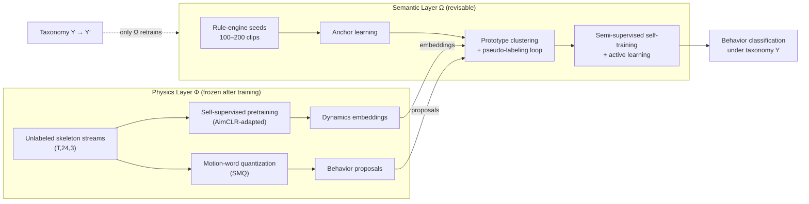
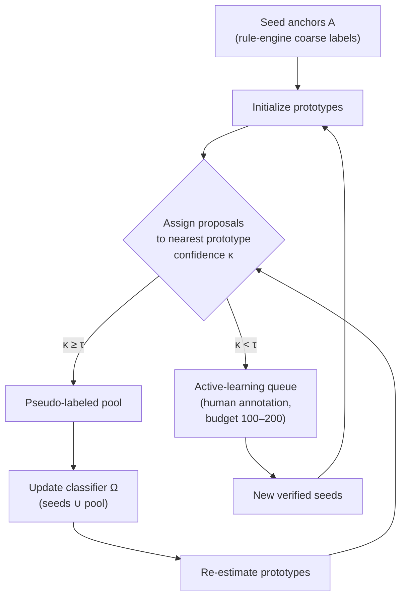

# 图表绘制规格（Figure Specs · P0.6 增量二）

> Owner: `docs/paper/figure-specs.md` · W5 窗口 2026-08-23 · 状态: v0.1——fig1/fig2 绘制规格 + Mermaid 结构图 + 自足 caption；fig3/fig4 待数据后补规格
> 执行标准: experiment-skeleton.md §图表规范（白底浅灰网格 / ≤6 色 / 低饱和淡彩 / 避红绿 / 矢量输出 / caption 自足）
> 用途: 绘图窗口（或用户手动绘图时）照此执行，无需重新设计

---

## fig1 — 框架总览图（hero，落点 §1 尾）

**结构**：左右双层架构 + 中央窄接口。左=物理层 Φ（蓝系），右=语义层 Ω（橙系），中间接口通道用灰色窄带强调"只通过 embeddings + proposals 通信"。底部输入为无标签骨架流（左）与规则引擎种子（右下），顶部输出行为分类。

**Caption 草稿（自足式）**：
> **Figure 1: The PSD framework.** A frozen physics layer Φ (left) turns unlabeled skeleton streams into dynamics embeddings and behavior proposals via self-supervised pretraining and motion-word quantization. A revisable semantic layer Ω (right) expands rule-engine seeds into taxonomy coverage through anchor-guided clustering with iterated confidence-filtered pseudo-labeling, consolidated by self-training and active learning. The layers communicate only through embeddings and proposals, so a taxonomy transition Y→Y′ retrains Ω alone.

**绘制要点**：
- 配色：物理层模块淡青 #DAFFFF 系、语义层淡橙 #FFE3DA 系、接口带 #DADADA、文字纯黑——共 ≤4 色
- "Y → Y′ only Ω retrains" 必须视觉显性化（虚线箭头 + 高亮），这是 hero 图的叙事核心
- 禁止 3D 效果、阴影、渐变

## fig2 — 语义层迭代闭环细节图（落点 §3.3）

**Caption 草稿**：
> **Figure 2: Anchor-guided iterative pseudo-labeling.** High-confidence assignments (κ≥τ) join the training pool; low-confidence proposals enter an active-learning queue for human verification. Prototypes are re-estimated each round; the physics encoder stays frozen.

**绘制要点**：闭环箭头方向一致顺时针；τ 阈值分叉是视觉焦点；预算数字标注在 AL 节点旁。

## fig3 / fig4（占位，规格待数据形态确认）

| ID | 内容 | 规格待定项 |
|----|------|-----------|
| fig3 | SMQ 分割边界 vs GT 定性对比（含局部放大） | 行数（序列样本数）、GT 来源标注方式 |
| fig4 | 主动学习效率曲线（uncertainty vs random，x=标注预算，y=精度） | 折数、误差棒来源（seed 级）、目标线 y=85% 虚线 |

## 自审记录

| 检查项 | 结果 |
|--------|------|
| caption 自足（不读正文可懂） | ✅ 两张草稿均可独立理解 |
| ≤6 色 + 白底 + 避红绿 + 灰度安全 | ✅ fig1 用色 4 种 |
| Mermaid 草图仅为结构示意，终图按规范矢量重绘 | ✅ 已声明 |

## 修订历史

| 版本 | 日期 | 变更 |
|------|------|------|
| v0.1 | 2026-08-23 | W5 增量二：fig1/fig2 规格 + Mermaid 草图 + caption 草稿 |
